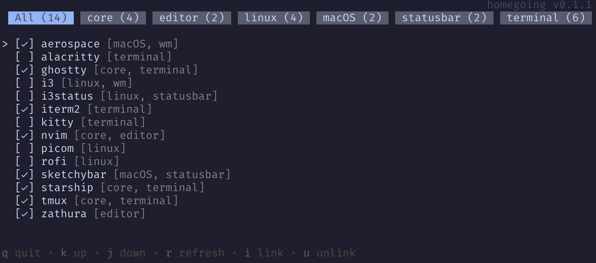

# homegoing

An interactive and simple to use CLI dotfiles manager.

 

## Installation
Install the latest version from source using *Go*'s built-in installer, or download a precompiled binary.
```bash
go install github.com/WilliamTrojniak/homegoing@latest
```

## Running
Run the homegoing command while in a directory containing a *dotfiles.toml* file.
```bash
homegoing
```

## Configuration
All configuration is done inside a *dotfiles.toml* file.

#### Fields

###### type: ```root```

| Property      | Type              | Description |
| :---          | :---:             | :---        |
| **src**       | ```filepath?```   | Path to the directory which all child ```src``` values are relative to. Defaults to the path of the configuration file's parent directory. |
| **dest**      | ```filepath?```   | Path to the directory which all child ```dest``` paths are relative to. Defaults to the path of the configuration file's parent directory. |
| **groups**    | ```group[]?```    | A recursive structure allowing for grouping of modules. |
| **modules**   | ```module[]?```   | List of modules at the root level. Each module represents a source directory/file to be symlinked. |


###### type: ```group``` 

| Property      | Type              | Description |
| :---          | :---:             | :---        |
| **src**       | ```filepath?```   | Path to the directory which all child ```src``` values are relative to.|
| **dest**      | ```filepath?```   | Path to the directory which all child ```dest``` values are relative to. |
| **groups**    | ```group[]?```    | A recursive structure which allows for grouping of dotmodules. |
| **modules**   | ```module[]?```   | List of modules within the grouping. Each module represents a source directory/file to be symlinked.|


###### type: ```module```

| Property      | Type              | Description |
| :---          | :---:             | :---        |
| **src**       | ```filepath```    | Path to the source directory/file to be pointed to by a symbolic link. |
| **dest**      | ```filepath?```   | Path to the directory in which the symbolic link should be created. |
| **name**      | ```string?```     | The display name of the module. Defaults to the name of the directory/file pointed to by ```src```. |
| **target**    | ```string?```     | The name of the created symbolic link. Defaults to the name of the directory/file pointed to by ```src```. |

#### Example Configuration
```TOML
# Specify base src and dest directory for child modules and groups
# Relative to this file's parent directory
# Environment variables are expanded when used within paths
src = "."
dest = "$HOME"

[[modules]]
    # Path to source file to be symlinked
    src = "bashrc"
    # Name of created symlink. Defaults to the name of the source directory/file
    target = ".bashrc"
    
[[groups]]
    # Relative to parent group's 'src' and 'dest'.
    src = "config"
    dest = ".config"

    [[groups.modules]]
        src = "nvim"
        # Display name of module. Defaults to the name of the source directory/file.
        name = "NeoVim"

    [[groups.groups]]
        # ...

[[groups]]
    # Aboslute paths override parent paths
    dest = "/opt"
    # ...

```

